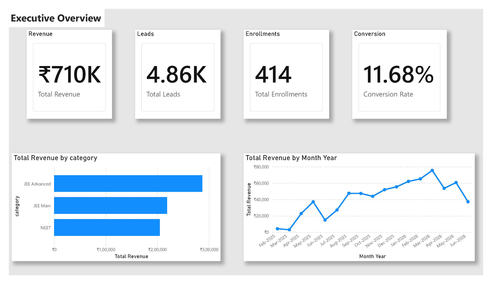
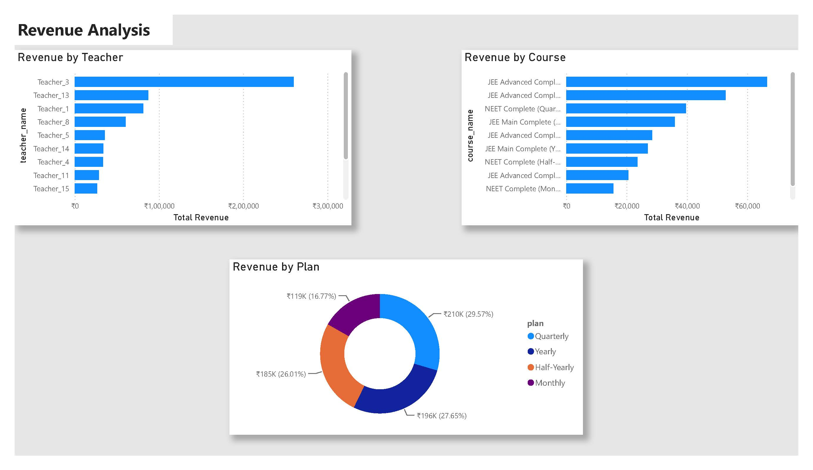
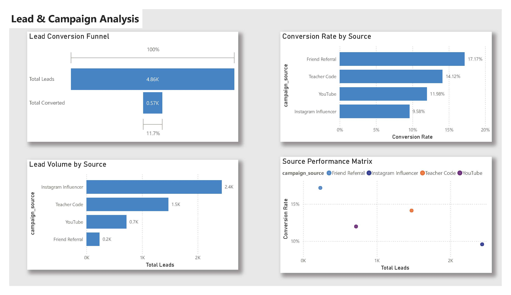
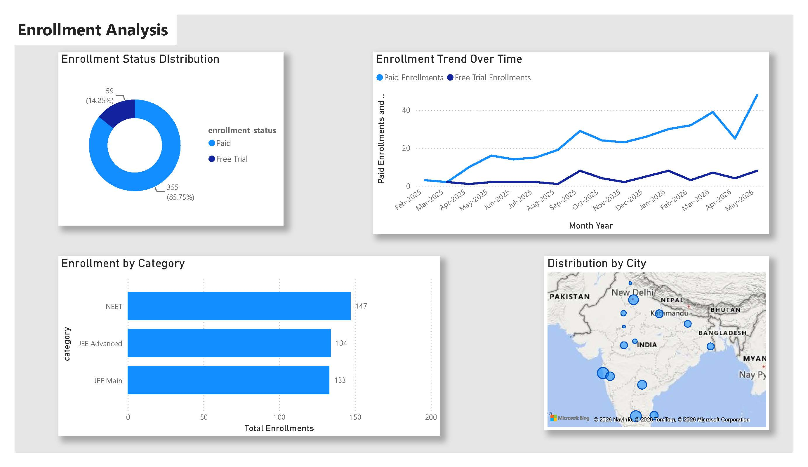
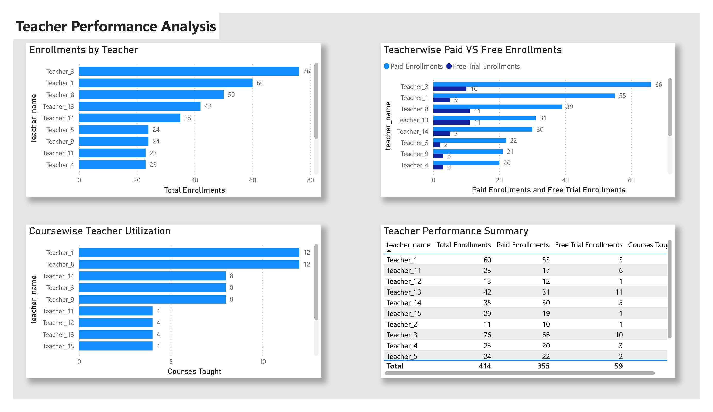
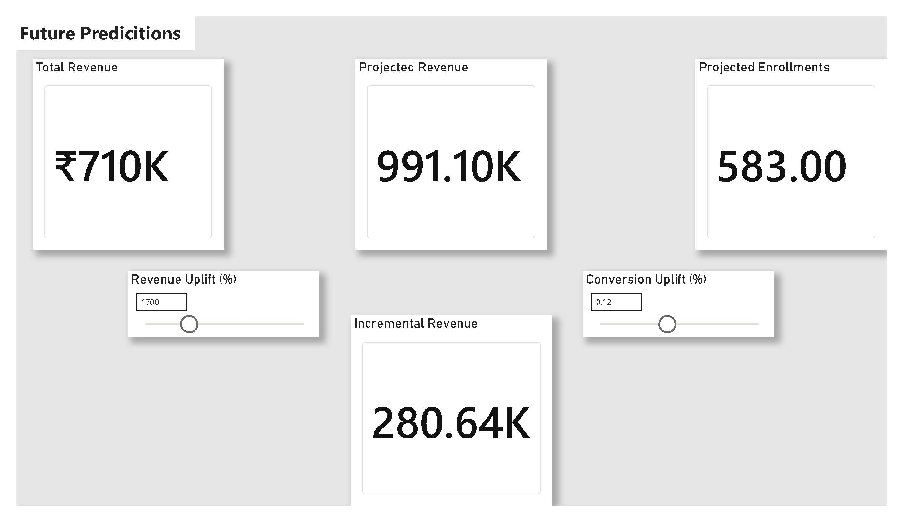
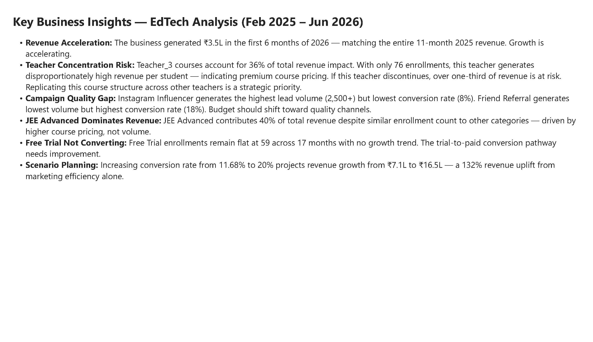

# EdTech Business Analysis — Power BI

A 7-page interactive Power BI dashboard built on the same 7-table EdTech dataset used in the SQL and Excel projects. This project goes beyond reporting into scenario planning — using What-If parameters to model the revenue impact of improving lead conversion.

---

## Live Connection

Unlike the SQL and Excel projects, this report connects directly to a live MySQL database (not static CSVs), using Power BI's native MySQL connector with explicit DAX measures, a custom date table, and `USERELATIONSHIP` to manage multiple fact tables sharing one date dimension.

---

## Dataset Overview

| Table | Records |
|---|---|
| Students | 995 |
| Courses | 80 |
| Enrollments | 414 |
| Payments | 355 paid + 59 free trial |
| Leads | 4,856 |
| Campaigns | 30 |
| Teachers | 15 |

**Period covered:** February 2025 – June 2026

---

## Report Pages

### 1. Executive Overview
KPI cards (Total Revenue, Total Leads, Total Enrollments, Conversion Rate) with revenue-by-category and monthly revenue trend visuals.

### 2. Revenue Analysis
Revenue by teacher, by course, and by subscription plan — showing where revenue actually comes from across three dimensions.

### 3. Lead & Campaign Analysis
Lead conversion funnel, conversion rate by campaign source, lead volume by source, and a scatter plot mapping volume against conversion quality — the strongest analytical page in the report.

### 4. Enrollment Analysis
Enrollment status split, enrollment trend over time, enrollment by category, and a geographic map showing enrollment concentration by city.

### 5. Teacher Performance Analysis
Reframed around teacher *impact*, not revenue ownership — enrollments by teacher, paid vs free trial split, courses taught, and a full teacher scorecard table.

### 6. Future Predictions
Interactive What-If scenario page. Two parameters — conversion rate uplift and average revenue per enrollment — let the user simulate projected revenue and incremental revenue against the current baseline in real time.

### 7. Key Business Insights
A written summary translating the dashboard's findings into six business recommendations.

---

## Technical Highlights

- **Live MySQL connection** via Power BI's native connector
- **Custom Date Table** built with `CALENDAR()`, connected to three fact tables (Payments, Enrollments, Leads) with managed active/inactive relationships
- **USERELATIONSHIP** used to activate enrollment-date and lead-date paths for time-based measures without breaking the primary payment-date relationship
- **What-If Parameters** for live scenario simulation (conversion rate and average revenue per enrollment)
- **DAX measures** including `CALCULATE`, `FILTER`, `DIVIDE`, and parameter-driven projection formulas
- Cross-filtering scatter plot for campaign volume vs. quality analysis
- Geographic bubble map for city-level enrollment distribution

---

## Key Findings

**Revenue Acceleration:** The business generated ₹3.5L in the first 6 months of 2026 — matching the entire 11-month 2025 revenue.

**Teacher Concentration Risk:** Teacher_3 accounts for 36% of total revenue impact from just 76 enrollments — a premium-pricing, high-concentration risk.

**Campaign Quality Gap:** Instagram Influencer drives the highest lead volume but the lowest conversion rate. Friend Referral drives the lowest volume but the highest conversion rate — a clear budget reallocation opportunity.

**Scenario Planning:** Improving conversion rate from 11.68% to 20% projects a 132% revenue uplift (₹7.1L → ₹16.5L) from marketing efficiency alone, with no change in lead volume.

---

## Tools Used

Power BI Desktop · DAX · MySQL (live connection) · What-If Parameters · Power Query

**Related projects:**
[EdTech Business Analysis — SQL](https://github.com/Nipunarya250/edtech_business_analysis) · [EdTech Business Analysis — Excel](https://github.com/Nipunarya250/EdTech-Business-Analysis-Excel)
